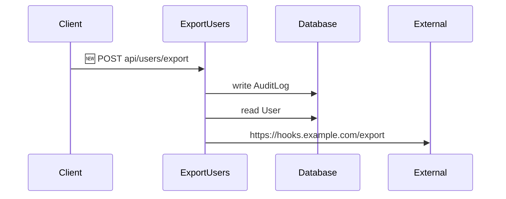

# Lenscheck: See What a Pull Request *Actually* Changes — On Every Repo You Own

*Git shows you what **lines** changed. Lenscheck shows you what they **mean**, where to look, and whether
they broke a rule. It's a semantic PR reviewer for Python web apps. This guide starts from zero —
every idea, command, and setting in plain English — then shows you how to set Lenscheck up **once** and
run it across **all your repos** (personal, team, or organization).*

---

## Table of contents

1. [What is Lenscheck (in one minute)](#1-what-is-lenscheck-in-one-minute)
2. [The one big idea: "what changed" vs "what it means"](#2-the-one-big-idea)
3. [Words you need to know (plain-English glossary)](#3-words-you-need-to-know)
4. [Install](#4-install)
5. [Three ways to use Lenscheck](#5-three-ways-to-use-lenscheck)
6. [The Web UI, panel by panel](#6-the-web-ui-panel-by-panel)
7. [The CLI, command by command, flag by flag](#7-the-cli-command-by-command)
8. [Every feature explained](#8-every-feature-explained)
9. [The GitHub Action, input by input](#9-the-github-action-input-by-input)
10. [Set up Lenscheck for all your repos (personal, team, or org)](#10-set-up-lenscheck-for-all-your-repos)
11. [A full worked example](#11-a-full-worked-example)
12. [Honesty rules (why Lenscheck never lies)](#12-honesty-rules)
13. [Quick reference card](#13-quick-reference-card)

---

## 1. What is Lenscheck (in one minute)

When you open a Pull Request (PR), the reviewer sees a **diff** — red lines removed, green lines
added. But a diff tells you *what text changed*, not **what it means**. Did this PR add a new way
into your app? Did it start writing to your database without a login check? Did someone's email
address just start leaving your server?

**Lenscheck reads your PR and tells you what it *means*** — in a few high-signal findings, each pointing
at the exact line to look at. It's built for Python web apps (Django / Django REST Framework today).

It is **not** an AI that guesses. It reads your code with Python's own parser and reports **facts**.
When it isn't sure, it says so (you'll see a ⚠). It never dresses up "I didn't see it" as "it's safe."


---

## 2. The one big idea

Every other tool answers **"what changed?"** Lenscheck answers a second, harder question:

> **"what *is* the code doing"** vs **"what it *should* be doing"**

That gap — between what your code actually does and what everyone assumed it does — is where bugs and
security holes live. Almost every Lenscheck feature is a version of comparing those two things:

- The PR title says *"just a refactor"* → but the code added a new endpoint. (**contradiction**)
- Your codebase has *always* required a login before writing to the DB → this PR broke that. (**invariant**)
- The old version of a library couldn't run shell commands → the new version can. (**dependency capability**)

---

## 3. Words you need to know

You'll meet these terms everywhere. Here they are in plain English.

**Endpoint** — a single "door" into your web app. A URL + the code that runs when someone hits it.
Example: `POST /api/users/export` runs the `ExportUsers` function. Lenscheck reviews your PR one
endpoint at a time.

**The 6-edge lens** — for each endpoint, Lenscheck asks six simple questions (these are the "edges"):

| Edge | The question it answers |
|------|-------------------------|
| **Route** | What URL is this, and which function handles it? |
| **Auth** | Do you need to be logged in? (or is it open to anyone?) |
| **DB** | Does it read or **write** the database? Which tables? |
| **External** | Does it call the outside world? (Stripe, a webhook, an API…) |
| **Async** | Does it kick off a background job? (Celery, a thread…) |
| **PII** | Does it touch **personal data** (email, phone, address…)? |

**Severity colors** — Lenscheck ranks every finding by how much it should worry you:

- 🔴 **critical** — security / data-flow (e.g. an open endpoint writing to the DB)
- 🟠 **high** — money paths (payments, orders)
- 🟡 **medium** — a new write or a dependency change
- 🟢 **low** — a safe refactor, nothing risky

**PII** — "Personally Identifiable Information": personal data like an **email, phone number,
address, password, card number**. Leaking it is a legal and trust problem.

**PII egress** — "egress" just means *leaving*. **PII egress** = personal data **leaving your
server** — sent to an external API, written to a log, or returned to the browser. That's the moment
that matters.

**Taint** — following a piece of data as it moves through the code. If an email is "tainted," Lenscheck
watches whether that exact value **reaches an exit** (an external call, a log, a response). If it
does, that's a confirmed leak.

**Invariant** — a rule your codebase has *always* followed, whether or not anyone wrote it down.
Example: *"every endpoint that writes to the database first checks you're logged in."* Lenscheck can
**discover** these from your git history, let you **confirm** the real ones, and then **enforce**
them on every PR.

**Semantic diff** — a normal diff compares *text*. A **semantic diff** compares *meaning*: Lenscheck
analyzes your code before and after the PR and reports the difference in **behavior** (new
endpoints, new DB writes, new calls…), ignoring cosmetic changes like renaming a function.

---

## 4. Install

```bash
pip install lenscheck-semantic-reviewer
```

That's it — Lenscheck has **zero dependencies** (it only uses Python's standard library). You now have a
`lenscheck` command. Check it:

```bash
lenscheck --help
```

```
Lenscheck Semantic Reviewer

Usage: lenscheck <command> [options]

Commands:
  review     Run a semantic review of a PR or commit range
  post       Post a review to a PR (sticky comment, inline comments, label)
  serve      Start the Lenscheck web UI
  invariants Discover baseline invariants from a repository's history
  digest     Org-wide roll-up from the labels Lenscheck applies to PRs
```

---

## 5. Three ways to use Lenscheck

You can use Lenscheck in whichever way fits:

1. **Web UI** — run `lenscheck serve`, open your browser, click around. Best for **exploring** and for
   people who don't live in the terminal. → [jump to the tour](#6-the-web-ui-panel-by-panel)
2. **Command line** — `lenscheck review …`. Best for **scripts, quick checks, and CI**. →
   [jump to the CLI](#7-the-cli-command-by-command)
3. **GitHub Action** — Lenscheck runs automatically on every PR and comments on it. Best for **teams**.
   → [jump to the Action](#9-the-github-action-input-by-input)

They all share the same engine, so they find the same things.

---

## 6. The Web UI, panel by panel

Start it inside any repo:

```bash
lenscheck serve
```

It prints a URL (like `http://127.0.0.1:8765/`) and opens your browser. If you run it inside a git
repo, it auto-detects that repo for you.

### The top bar — choosing what to review


Along the top you pick **what** to compare. You have four ways:

- **PR** — pick a merged Pull Request from the dropdown and hit **Review**.
- **branches** — compare two branches (e.g. `main` → `my-feature`).
- **commits** — compare two commits.
- **Branch vs default** button — the one-click shortcut: review *your current branch* against the
  *main branch*. (This is [feature #8](#feature-8--smart-default-target).)

### Reading a review (top to bottom)

Once a review runs, you read it top-to-bottom. Using the screenshot above:

1. **The one-line summary** — *"This PR adds 1 endpoint, 1 new DB write to `AuditLog`, 1 new
   external call… and 4 new PII signals."* A plain-English sentence of everything that changed,
   built from facts. ([feature #3](#feature-3--the-intent-summary))

2. **🎭 Intent vs. behavior** — the red panel. The PR called itself a *"refactor / no behavior
   change,"* but Lenscheck found it **added an endpoint** and **started logging an email**. When the
   promise and the facts disagree, this panel calls it out. ([feature #4](#feature-4--intent-vs-behavior-contradiction))

3. **📦 Dependency capability changes** — bumped libraries and whether the new version can *do* more
   than the old one. ([feature #5](#feature-5--dependency-capability-delta))

4. **The tally** — 🔴 2 — how many findings at each severity.

5. **The change list** (left) — one row per changed endpoint, worst first. Click a row to see…

6. **The flow graph** (right) — a live picture of what that endpoint does. In the screenshot,
   `ExportUsers` → writes **AuditLog**, reads **User**, and calls **hooks.example.com** — with new
   parts highlighted. This is the same picture Lenscheck can also draw as a
   [Mermaid diagram](#feature-7--mermaid-flow-diagram) inside a GitHub comment.

### The Invariants panel — teach Lenscheck your rules

Click **⚖ Invariants** in the top bar:


Lenscheck samples your git history and shows **candidate rules** it noticed your codebase following. In
the screenshot:

- *"Authenticated access before any DB write"* — holds **3/4 (75%)**, with the one exception named
  (`api/users/export`). The `[near-miss]` tag means "almost always true" — which is exactly what a
  real rule-with-one-bug looks like.
- Each rule has a **Confirm** button (freeze it as a rule Lenscheck will enforce from now on) and a
  **🩸 Blame** button (find the commit that first broke it).

This is the **moat** — over time you teach Lenscheck the rules *your* codebase cares about, and no
competitor has that knowledge. ([feature #10](#feature-10--invariants-discover-confirm-enforce-blame))

> **Note:** the **Confirm** buttons only appear if you started the server with a place to save them:
> `lenscheck serve --invariants my-rules.json`. Without that, the panel is read-only (Lenscheck never writes
> a file you didn't ask for).

### Handy web tricks

- `http://…/?open=0` — deep-link that opens the review with the first change already selected.
- `http://…/?invariants=1` — deep-link that opens the Invariants panel automatically.

---

## 7. The CLI, command by command

### `lenscheck review` — the main event

Analyze a PR / branch / commit and print a review.

```bash
lenscheck review                       # no args: review THIS branch vs the default branch
lenscheck review /path/to/repo --base main --head my-feature
lenscheck review https://github.com/owner/repo --pr 123
```

**Positional argument:**

| Argument | Meaning |
|----------|---------|
| `repo` | A local folder **or** a GitHub URL. **Optional** — leave it out and Lenscheck uses the repo you're standing in. |

**Flags — how to pick what to compare** (choose one; or none to auto-detect):

| Flag | What it does |
|------|--------------|
| *(nothing)* | Review the **current branch vs. the default branch**. The zero-effort mode. |
| `--pr 123` | Review a real GitHub Pull Request by number (needs a GitHub URL as the repo). |
| `--base X --head Y` | Review the difference between two refs (branches, tags, or commit SHAs). |
| `--commit SHA` | Review a single commit (compares it against its parent). |
| `--merge SHA` | Review a merge commit (compares its two parents). |

**Flags — what to produce:**

| Flag | What it does |
|------|--------------|
| `--out FILE` | Where to write the Markdown report. Default: `pr_review.md`. |
| `--json FILE` | Also write the full review as structured JSON (for tools/automation). |
| `--html FILE` | Also write a **self-contained HTML** viewer you can open in a browser. |
| `--sarif FILE` | Also write **SARIF** — the format GitHub reads to show findings in its Security tab. ([feature #2](#feature-2--sarif-output)) |
| `--invariants FILE` | Enforce a confirmed rules file: flag any endpoint in this PR that breaks a rule. |
| `--fail-on violation` | **Exit with an error** if the PR breaks a confirmed rule. (Use in CI to block merges.) |
| `--fail-on crit` | Exit with an error on **any** 🔴 finding. |

### `lenscheck post` — put the review on the PR

Takes a review you already generated and posts it to a GitHub PR.

```bash
lenscheck post 123 pr_review.md --json pr_review.json --inline --label
```

| Argument / flag | What it does |
|-----------------|--------------|
| `123` | The PR number. |
| `pr_review.md` | The Markdown body to post as a **sticky comment** (it updates in place on re-runs). |
| `--json FILE` | The structured review (needed for `--inline` and `--label`). |
| `--inline` | Post each finding as a comment **pinned to the exact changed line**. ([feature #1](#feature-1--inline-pr-comments)) |
| `--label` | Put one `lenscheck:*` **label** on the PR based on its worst finding. ([feature #6](#feature-6--auto-label)) |
| `--dry-run` | Print what *would* be posted, without touching GitHub. Great for testing. |

*(Needs a `GITHUB_TOKEN` env var and the `gh` CLI, which GitHub's runners already have.)*

### `lenscheck serve` — the web UI

```bash
lenscheck serve --repo /path/to/repo --port 8765
```

| Flag | What it does |
|------|--------------|
| `--repo` | Repo to preload (default: the git repo of the current folder). |
| `--invariants FILE` | The rules file to enforce **and** the file the Confirm buttons write to. |
| `--port` / `--host` | Where to serve (default `8765` on `0.0.0.0`). |
| `--pr` / `--commit` / `--merge` / `--base` / `--head` | Open straight into a specific review on load. |
| `--no-open` | Don't auto-open a browser window. |

Useful **environment variables** for a hosted deployment:

| Env var | What it does |
|---------|--------------|
| `PORT` / `HOST` | Where to bind (hosts like Render set `PORT`; default `HOST` is `0.0.0.0`). |
| `LENSCHECK_TOKEN` | Require `?token=…` on API calls — **set this on any public deployment.** |
| `LENSCHECK_ALLOWED_REPOS` | Comma-separated allow-list; only matching repos may be reviewed. |
| `LENSCHECK_BASE_PATH` | Serve under a sub-path (e.g. `/lenscheck`) behind a reverse proxy. |
| `LENSCHECK_DEFAULT_REPO` | The repo shown by default in the UI. |
| `LENSCHECK_INVARIANTS` | Default invariant corpus path to enforce in the UI. |
| `GITHUB_TOKEN` | For private repos / to avoid GitHub rate limits. |

To host one shared Lenscheck UI: run `lenscheck serve --no-open` behind your usual reverse proxy, set
`LENSCHECK_TOKEN` (so the API isn't open), and optionally `LENSCHECK_ALLOWED_REPOS` to fence it to just your
repos. To run Lenscheck across *all* your repos from one place, see
[§10 — Set up Lenscheck for all your repos](#10-set-up-lenscheck-for-all-your-repos).

### `lenscheck invariants` — discover, confirm, and blame rules

Three jobs in one command.

**Discover** — look through git history and propose candidate rules:

```bash
lenscheck invariants /path/to/repo --snapshots 8
```

| Flag | What it does |
|------|--------------|
| `--snapshots N` | How many points in history to sample (more = slower but more confident). |
| `--out FILE` | Where to write the discovered candidates (JSON). |
| `--report FILE` | Where to write a human-readable report (Markdown). |

**Confirm** — turn candidates into a rules file *without hand-editing JSON*:

```bash
lenscheck invariants --confirm                       # interactive: press c / f / s / q per rule
lenscheck invariants --confirm --id auth-before-write --owner security   # scripted
```

| Flag | What it does |
|------|--------------|
| `--confirm` | Enter confirm mode. Interactive unless you pass `--id` or `--all`. |
| `--in FILE` | The discovered candidates to read from. |
| `--corpus FILE` | The confirmed rules file to create/update. |
| `--id NAME` | Confirm a specific rule (repeatable). |
| `--all` | Confirm every candidate. |
| `--owner NAME` | Record who owns the rule. |
| `--drop-baseline` | Treat today's exceptions as **bugs to fix**, not as accepted. |

In interactive mode you press one key per rule: **c**onfirm · **f**ix (confirm, but the current
exceptions are bugs) · **s**kip · **q**uit.

**Blame** — find the commit that first broke a rule ([semantic blame](#feature-10--invariants-discover-confirm-enforce-blame)):

```bash
lenscheck invariants /path/to/repo --blame auth-before-write --exact
```

| Flag | What it does |
|------|--------------|
| `--blame NAME` | Which rule to investigate. |
| `--route R` | Only blame a specific endpoint. |
| `--exact` | **Pinpoint the precise commit** (binary-searches history; a bit slower). Without it, you get the window between two sampled snapshots. |

### `lenscheck digest` — the org-wide roll-up for leadership

Every other command answers *"is **this** PR risky?"*. `digest` answers the question a manager
actually asks: *"across **all** our repos, how much risk is sitting in review right now?"* — in one
short message, with **no re-analysis** and **no GitHub Advanced Security**.

It works by counting labels. Each PR review applies exactly one `lenscheck:*` triage label
([feature #6](#feature-6--auto-label)); the digest just searches an org for the **open** PRs still
carrying each one:

```bash
lenscheck digest --org my-org --slack "$SLACK_WEBHOOK"
```

```
*Lenscheck digest — my-org*  (open PRs by risk)
🔴  4  security / PII / unauth write
🟠  9  money path
🟡 12  new DB write / external
```

| Flag | What it does |
|------|--------------|
| `--org ORG` | The GitHub org/owner to summarize (**required**). |
| `--repos FILE` | Optional file of `owner/repo` lines → adds an adoption line: how many repos have the workflow live and a confirmed invariants file. |
| `--slack URL` | Post the digest to a Slack incoming webhook (otherwise it just prints). |

Needs a `GITHUB_TOKEN` with **org read** access (the default per-repo token can't search the org).
An honesty rule carries over from the analyzer: a tier it couldn't fetch shows `?`, never a
fake `0`. Run it on a schedule (a weekly cron in a central repo) and it becomes the standing
answer to "is Lenscheck worth keeping on?" — because the labels feed it, keep `label: true` and
`issues: write` on your review workflow.

---

## 8. Every feature explained

### Semantic diff & severity (the foundation)

Lenscheck analyzes your code **before** and **after** the PR and reports the change in **behavior**.
Renaming a function with no behavior change? Silence (that's a good thing). Adding an
unauthenticated database write? 🔴. Every finding is ranked 🔴/🟠/🟡/🟢 and points at a `file:line`.

### Feature #3 — the intent summary

One plain-English sentence at the top of every review, built from verified facts:

> *"This PR adds 1 endpoint, 1 new DB write to `AuditLog`, 1 new external call to
> `hooks.example.com/export` and 4 new PII signals."*

Other tools generate this with an AI that reads the diff and sometimes makes things up. Lenscheck counts
real facts, so every number traces to a line.

### Feature #4 — intent vs. behavior contradiction

Your PR title/description is a **promise**. Lenscheck checks it against the facts.

- Says **"refactor / no behavior change"** but added an endpoint or a DB write → 🔴 *"claims
  refactor, but behavior changed here."*
- Says **"docs only"** but code changed → flagged.

From the demo, the PR titled *"refactor: tidy up user views"* got caught twice:

```
🎭 Intent vs. behavior — PR describes itself as "refactor / no behavior change", but the facts disagree
🔴 claims refactor / no behavior change, but adds an endpoint — api/users/export @ shop/views.py:40
🔴 claims refactor / no behavior change, but new PII signal: email → log.info — api/profile @ shop/views.py:32
```

### Feature #5 — dependency capability-delta

When a PR bumps a library, Lenscheck downloads the **old** and **new** versions and compares what each
can *do* — checking for **network / subprocess / native code / file writes / reading secrets**. It
reports only the **newly gained** powers:

- `requests 2.28→2.31: no new capabilities` 🟢
- `leftpad 1.0→2.0: now spawns a subprocess` 🔴

If it can't fetch a version (offline, or the package has no source), it says **⚠ unresolved** — never
"safe":

```
📦 Dependency capability changes
⚠ requests 2.28.0→2.31.0 — capabilities not statically resolved (offline or no sdist)
⚠ six 1.15.0→1.16.0 — capabilities not statically resolved (offline or no sdist)
```

Turn the network scan off with `LENSCHECK_SCAN_DEPS=0` (or the Action's `scan_deps: false`) and you'll
always get the fast ⚠ mode.

### Feature #9 — PII taint

The star precision feature. Old tools say *"personal data and an external call are both in this
function — maybe it leaks."* Vague. Lenscheck **follows the data**:

- If an email actually **flows into** an external call / log / response → ✅ **verified**:
  `email → requests.post @ line 46`. The exact field, the exact exit, the exact line.
- If they just co-exist with no traced path → it stays **⚠ potential** (honest, no false alarm).
- If the data passes through a function Lenscheck doesn't recognize (which *might* clean it) → it
  **refuses** to call it a confirmed leak.

It also resolves fuzzy database writes: `for order in Order.objects.filter(...): order.save()` is now
understood as writing the **Order** table, not a vague `<instance>`.

### Feature #10 — invariants: discover, confirm, enforce, blame

The compounding asset. Four steps:

1. **Discover** (`lenscheck invariants`) — mine history for rules your code already follows:

   ```
   ⚠ NEAR-MISS — Authenticated access before any DB write
   - holds: 3/4 endpoints (75%)  ·  persistence: 100% → 100% → 100% → 75% across 4 snapshots
   - exceptions — look here (1):
       - api/users/export — open (AllowAny)  (shop/views.py:40)
   ```

2. **Confirm** (`lenscheck invariants --confirm`, or the web button) — mark the ones that are real. Saved
   to a rules file. No JSON editing.

3. **Enforce** (`lenscheck review --invariants rules.json`) — every future PR that breaks a confirmed
   rule gets a 🔴, and `--fail-on violation` can block the merge.

4. **Blame** (`lenscheck invariants --blame … --exact`) — find exactly which commit broke a rule:

   ```
   🩸 auth-before-write first broke at e23c96a (exact, in window 3e9817b..e23c96a)
      holds 3/4 at the snapshot.
      offending endpoint(s):
        - api/users/export — open (AllowAny) (shop/views.py:40)
   ```

**Bootstrap (turn it on everywhere, no human):** confirming rules per repo doesn't scale to 20
repos. `lenscheck invariants <repo> --bootstrap --baseline org-baseline.json` discovers the rules,
auto-confirms the safe ones, and **freezes today's state as the baseline** — so the rule file is a
*ratchet*: it only fires on a **new** violation a PR introduces, never on existing debt. Seed it
with a shared org baseline (the universal rules) and every repo inherits the same policy; each
repo's own exceptions are filled in automatically. Auto-confirmed rules are tagged
`owner: auto-bootstrap` so a human can review them later. This is what makes the moat adoptable
across a whole org instead of one repo at a time.

### Feature #2 — SARIF output

`--sarif pr_review.sarif` writes a standard file GitHub understands. Upload it and your findings show
up **on the exact changed lines** in the PR's "Files changed" tab and in the repo's **Security** tab
— native, official, high-visibility.

### Feature #1 — inline PR comments

`lenscheck post … --inline` pins each finding as a comment **on the exact line**. The honest guard: it
only pins a comment where it can prove the line is in the diff (GitHub rejects anything else); the
rest roll into the one sticky summary comment.

### Feature #6 — auto-label

`lenscheck post … --label` puts **one** triage label on the PR based on its worst finding:
`lenscheck:🔴security` / `lenscheck:🟠payment` / `lenscheck:🟡new-write` / `lenscheck:🟢safe-refactor`. Makes a queue
of PRs scannable at a glance.

### Feature #7 — Mermaid flow diagram

Every review's Markdown includes a **Mermaid sequence diagram** of the before→after flow. GitHub
renders it right inside the PR comment — a real picture of your endpoint's behavior, drawn from
facts, not by an AI:

````markdown

````

### Feature #8 — smart default target

Running `lenscheck review` with **no arguments** inside a repo just does the obvious thing: reviews your
**current branch vs. the default branch**. If you're *on* the default branch, it tells you to switch
to a feature branch instead of guessing.

---

## 9. The GitHub Action, input by input

Add this workflow and Lenscheck reviews every PR automatically:

```yaml
# .github/workflows/lenscheck.yml
name: Lenscheck Semantic Review
on: pull_request
permissions:
  contents: read
  pull-requests: write     # to post comments
  issues: write            # to apply the label
  security-events: write   # to upload SARIF
jobs:
  lenscheck:
    runs-on: ubuntu-latest
    steps:
      - uses: AnkushSinghGandhi/lenscheck-semantic-reviewer@v1
        with:
          fail_on: none          # or: violation | crit
```

Every input:

| Input | Default | What it does |
|-------|---------|--------------|
| `github_token` | auto | Token for reading the PR and posting back. |
| `fail_on` | `none` | `violation` fails the build on a broken rule; `crit` fails on any 🔴. |
| `invariants` | *(none)* | Path to a confirmed rules file to enforce. |
| `comment` | `true` | Post the sticky summary comment. |
| `inline` | `true` | Also post inline comments on changed lines. ([#1](#feature-1--inline-pr-comments)) |
| `label` | `true` | Apply one `lenscheck:*` label. ([#6](#feature-6--auto-label)) |
| `scan_deps` | `true` | Scan bumped dependencies against PyPI. Set `false` to skip the network (findings become ⚠). ([#5](#feature-5--dependency-capability-delta)) |
| `upload_sarif` | `true` | Upload SARIF to code scanning. Set `false` on private repos **without** GitHub Advanced Security so the step is skipped and the check stays green. |

The Action uploads SARIF (when `upload_sarif` is on), so findings appear in the Security tab —
that surface needs GitHub Advanced Security on private repos. Without GHAS, the same findings still
arrive as the PR comment, inline comments, and label, and an org-wide roll-up is available via
`lenscheck digest` (below).

---

## 10. Set up Lenscheck for all your repos

Section 9 put Lenscheck on **one** repo. This section turns it on across **every repo you own** —
personal projects, a team's services, or a whole company — from **one place**, with almost no
per-repo work.

The trick: **host the workflow once, and have every repo point at it.** Then you switch Lenscheck on (or
change how it behaves) by editing a single file, not twenty. It's the same steps whether you have 1
repo or 100.

### Step 1 — Put the workflow in one central repo

Make a repo — call it `lenscheck-workflows` (under your username or org) — and add the real workflow
there **once**, as a **reusable workflow**:

```yaml
# lenscheck-workflows/.github/workflows/lenscheck.yml
name: Lenscheck
on: { workflow_call: {} }
permissions: { contents: read, pull-requests: write, issues: write }
jobs:
  lenscheck:
    runs-on: ubuntu-latest
    steps:
      - uses: actions/checkout@v4
        with: { fetch-depth: 0 }
      - uses: AnkushSinghGandhi/lenscheck-semantic-reviewer@v1
        with:
          comment: 'true'
          fail_on: none          # observe mode — never blocks a merge (yet)
          upload_sarif: false    # set true only if you have GitHub Advanced Security
```

Then every repo gets a tiny **3-line caller** that just points at it:

```yaml
# any-repo/.github/workflows/lenscheck.yml
name: Lenscheck
on: { pull_request: {} }
jobs:
  lenscheck:
    uses: your-name/lenscheck-workflows/.github/workflows/lenscheck.yml@v1
    permissions: { contents: read, pull-requests: write, issues: write }
```

Now updating Lenscheck *everywhere* means editing **one** file in `lenscheck-workflows`. That's the
"centralised" part — and it's identical for a personal account, a team, or an org.

### Step 2 — Start in "observe mode" (comment, never block)

Notice `fail_on: none` above. That's **observe mode**: Lenscheck posts its review on every PR but
**can never block a merge**. Zero risk — you and your team see the value for a week or two before it
can ever get in the way. You turn on blocking later, once you trust it (Step 5).

> Keep `issues: write` + `label: 'true'` on. Lenscheck puts one `lenscheck:*` label on each PR, and Step 4's
> roll-up counts those labels — no label, no roll-up.

**Adding the caller to many repos:** for a handful, paste it in by hand. For a lot, a small script
that loops your repo list and opens the 3-line PR on each (using the `gh` CLI) does it in one go — or,
on GitHub Enterprise, an org "required workflow" applies it automatically.

### Step 3 — Turn on your rules (the moat), everywhere, automatically

This is the part that makes Lenscheck *yours*: enforcing the promises **your** code already keeps
("always log in before writing to the DB", "personal data never leaves without auth"). Normally you'd
discover rules, confirm each by hand, and commit a file — fine for one repo, tedious for many.

`lenscheck invariants --bootstrap` does it with **no human**:

```bash
lenscheck invariants <repo> --bootstrap --baseline org-baseline.json --out lenscheck-invariants.json
```

It finds the repo's rules, auto-confirms the safe ones, and **freezes today's state** as the starting
line — so it only ever complains about a **new** violation a future PR introduces, never your existing
code. Zero noise.

Write your shared rules once in an `org-baseline.json` (start from
[`org-baseline.sample.json`](../org-baseline.sample.json)) — the universal ones like *auth before any
DB write* and *no new external destination for personal data* — and every repo inherits them. Commit
each repo's `lenscheck-invariants.json`, and the workflow enforces it from then on.

### Step 4 — Get one number across all your repos (optional)

Per-PR comments help whoever's on that PR. For the **big picture** — *how many risky PRs are open
right now* — `lenscheck digest` counts the open PRs carrying each `lenscheck:*` label:

```bash
lenscheck digest --org your-github-org --slack "$SLACK_WEBHOOK"
```

```
🔴  4  security / PII / unauth write
🟠  9  money path
🟡 12  new DB write / external
```

No re-analysis, and **no GitHub Advanced Security needed** — it just reads the labels. Run it on a
weekly schedule and pipe it to Slack. (This one aggregates a whole GitHub **org**; for personal repos
the per-PR labels already give you the same signal on each PR.)

### Step 5 — Start blocking merges — last, and only on the sure things

Once people trust the reviews, flip the switch in your **one** central file — and only for the
highest-confidence signal:

```yaml
      - uses: AnkushSinghGandhi/lenscheck-semantic-reviewer@v1
        with:
          fail_on: violation     # block only when a PR breaks a confirmed rule
```

Never block on "any 🔴" from day one — that's how a tool gets switched off. Block only on a **new rule
violation**, once your rules are confirmed and trusted.

### One security note before you go wide

If other people will depend on this, **mirror the Action into your own account/org and pin a commit
SHA** instead of pointing at a public `@v1` tag — the reusable workflow means you fix that in one
place. And to reassure any security reviewer: Lenscheck **never runs your code** — it reads it with
Python's parser and analyzes clean git snapshots, so there's nothing to execute.

---

## 11. A full worked example

Here's the exact scenario from the screenshots. A developer opens a PR titled
**"refactor: tidy up user views."** It claims to be a harmless cleanup. In reality it:

- adds `POST /api/users/export` with **no login required** (`AllowAny`),
- inside it, writes to the `AuditLog` table and **sends a user's email to an external webhook**,
- and changes `GET /api/profile` to **log the user's email**,
- while bumping `requests` and `six`.

Run it:

```bash
lenscheck review /path/to/repo --commit <sha> --sarif out.sarif
```

Lenscheck produces, in one pass:

- **Summary:** *"adds 1 endpoint, 1 new DB write to `AuditLog`, 1 new external call… and 4 new PII
  signals."*
- **🎭 Contradiction:** *"claims refactor, but adds an endpoint"* and *"…but new PII signal:
  email → log.info."*
- **🔴 NEW ENDPOINT `api/users/export`:** *"new endpoint exposes a PII path with open/unspecified
  auth"* — with the verified leak `email → requests.post @ shop/views.py:46`.
- **📦 Dependencies:** the two bumps (with capabilities, or ⚠ offline).
- **🔀 Flow diagram:** the Mermaid picture above.

Every single item points to a line you can click. Nothing was guessed.

---

## 12. Honesty rules

Lenscheck's whole value is that you can **trust** it. So it follows strict rules:

- **Never render "not observed" as "doesn't exist."** If Lenscheck can't follow something, it shows ⚠ or
  ? — never a false all-clear.
- **A "verified" finding is really verified.** The PII taint only says ✅ when it saw the whole path;
  if data might have been sanitized, it stays ⚠.
- **No arbitrary file writes, no surprise network.** The web "Confirm" only writes the file you
  configured; dependency scanning can be turned off.
- **Every number traces to a `file:line`.** Because Lenscheck reports facts, not vibes.

---

## 13. Quick reference card

```bash
# review
lenscheck review                                  # this branch vs default branch
lenscheck review . --base main --head feature     # two refs
lenscheck review URL --pr 123                      # a GitHub PR
lenscheck review . --commit <sha>                  # one commit
lenscheck review . --sarif out.sarif --html r.html # extra outputs
lenscheck review . --invariants rules.json --fail-on violation   # enforce + block

# post to a PR
lenscheck post 123 pr_review.md --json pr_review.json --inline --label
lenscheck post 123 pr_review.md --dry-run          # preview, no posting

# web UI
lenscheck serve                                    # this repo
lenscheck serve --repo . --invariants rules.json   # + enable Confirm buttons

# invariants (rules)
lenscheck invariants .                             # discover candidate rules
lenscheck invariants --confirm                     # confirm interactively
lenscheck invariants --confirm --id auth-before-write --owner security
lenscheck invariants . --bootstrap --baseline org-baseline.json   # auto-confirm + ratchet (no human)
lenscheck invariants . --blame auth-before-write --exact   # who broke it

# digest (org-wide roll-up for leadership)
lenscheck digest --org my-org                       # open PRs by lenscheck:* label
lenscheck digest --org my-org --repos repos.txt --slack "$SLACK_WEBHOOK"  # + adoption, to Slack

# env vars
LENSCHECK_SCAN_DEPS=0     # skip the dependency network scan
LENSCHECK_TOKEN=…         # lock down a hosted `lenscheck serve`
```

---

*Lenscheck is open source. Built by [Ankush Singh Gandhi](https://warriorwhocodes.com). Questions,
stars, and sponsorships welcome on [GitHub](https://github.com/AnkushSinghGandhi/lenscheck-semantic-reviewer).*
